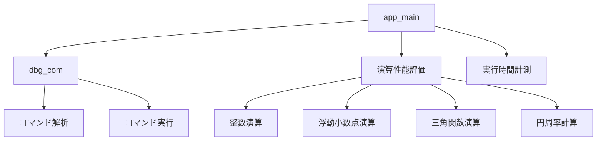
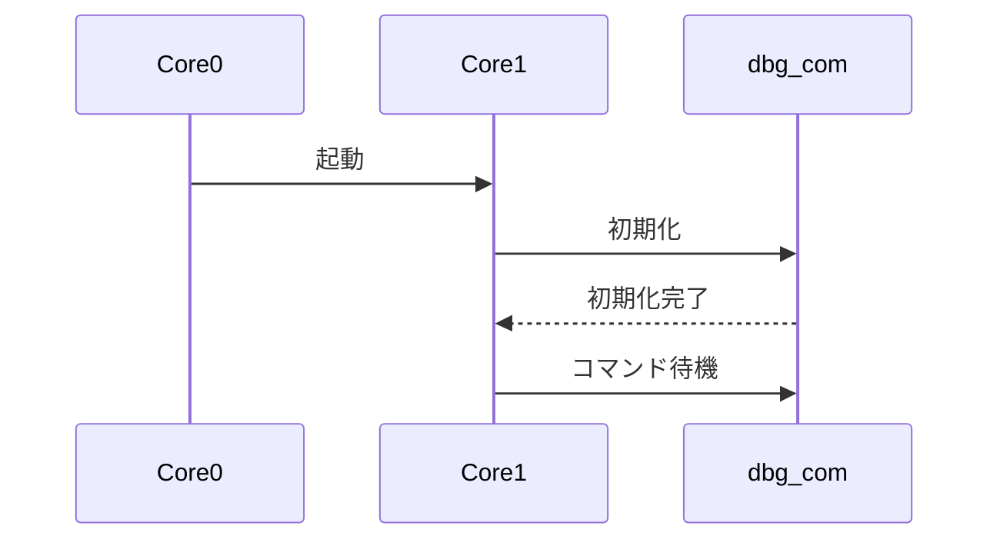
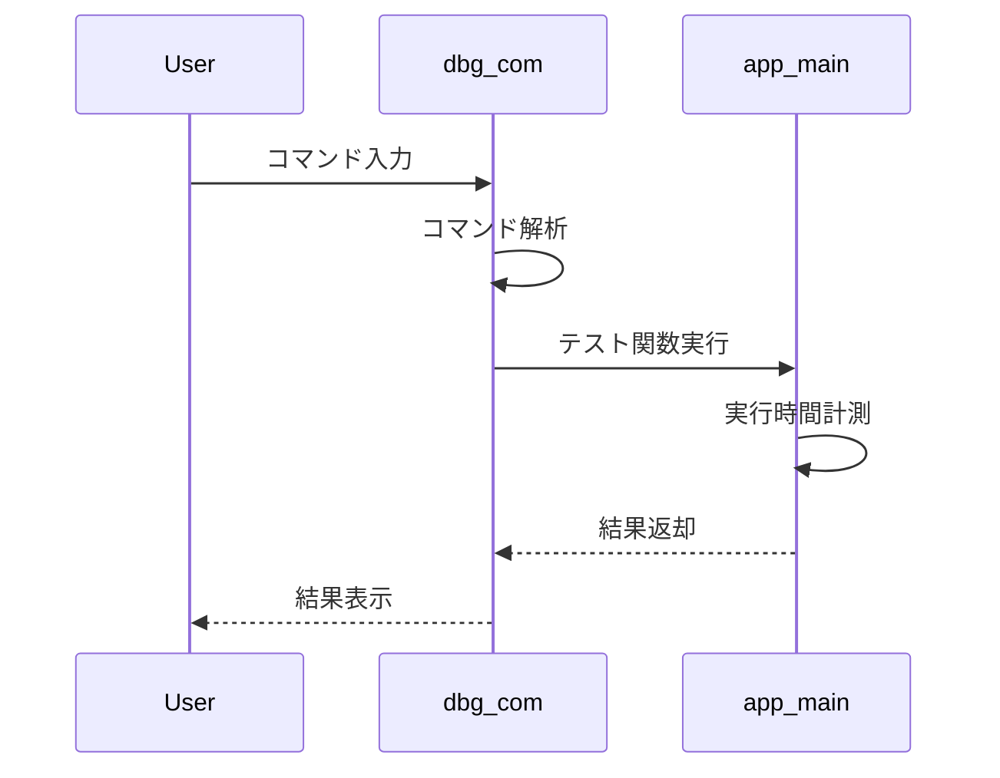

# RP2350評価F/W設計書

## 1. 概要

RP2350で動作するデバッグコマンドモニターの設計仕様書。
整数演算、浮動小数点演算、三角関数演算などの実行時間の計測も可能して性能を評価する。

## 2. システム構成

### 2.1 モジュール構成



### 2.2 シーケンス図

#### 2.2.1 システム起動シーケンス


#### 2.2.2 コマンド実行シーケンス


## 3. API仕様

### 3.1 デバッグコマンドモニター (dbg_com)

#### 3.1.1 初期化関数
```c
void dbg_com_init(void);
```
- 機能: デバッグコマンドモニターの初期化
- 引数: なし
- 戻り値: なし

#### 3.1.2 メイン処理関数
```c
void dbg_com_process(void);
```
- 機能: デバッグコマンドモニターのメイン処理
- 引数: なし
- 戻り値: なし

### 3.2 アプリケーション (app_main)

#### 3.2.1 整数演算テスト
```c
void int_add_test(void);
void int_sub_test(void);
void int_mul_test(void);
void int_div_test(void);
```
- 機能: 整数演算のテスト実行
- 引数: なし
- 戻り値: なし
- 備考: TEST_LOOP_CNT回（100万回）の演算を実行

#### 3.2.2 浮動小数点演算テスト
```c
void float_add_test(void);
void float_sub_test(void);
void float_mul_test(void);
void float_div_test(void);
void double_add_test(void);
void double_sub_test(void);
void double_mul_test(void);
void double_div_test(void);
```
- 機能: 浮動小数点演算のテスト実行
- 引数: なし
- 戻り値: なし
- 備考: TEST_LOOP_CNT回（100万回）の演算を実行

#### 3.2.3 三角関数テスト
```c
void trig_functions_test(void);
void atan2_test(void);
void tan_355_226_test(void);
void inverse_sqrt_test(void);
```
- 機能: 三角関数演算のテスト実行
- 引数: なし
- 戻り値: なし
- 備考: 各関数の演算結果を表示

#### 3.2.4 円周率計算
```c
double calculate_pi_gauss_legendre(int iterations);
```
- 機能: Gauss-Legendreアルゴリズムによる円周率計算
- 引数: iterations - 計算の反復回数
- 戻り値: 計算された円周率の値
- 備考: 高精度な計算結果を返却

#### 3.2.5 実行時間計測
```c
void measure_execution_time(void (*func)(void), const char* func_name, ...);
```
- 機能: 関数の実行時間を計測
- 引数:
  - func: 計測対象の関数ポインタ
  - func_name: 関数名（表示用）
  - ...: 可変長引数
- 戻り値: なし
- 備考: time_us_32()を使用したマイクロ秒単位の計測

## 4. ソース仕様

### 4.1 定数定義
```c
#define TEST_LOOP_CNT 1000000  // 演算テストの実行回数
#define DBG_CMD_MAX_LEN 32     // コマンドの最大長
#define DBG_CMD_MAX_ARGS 4     // コマンドの最大引数数
```

### 4.2 データ構造
```c
typedef struct {
    const char* p_cmd_str;     // コマンド文字列
    dbg_cmd_t cmd_type;        // コマンド種類
    const char* p_description; // コマンドの説明
    int32_t min_args;          // 最小引数数
    int32_t max_args;          // 最大引数数
} dbg_cmd_info_t;

typedef struct {
    int32_t argc;                    // 引数の数
    char* p_argv[DBG_CMD_MAX_ARGS]; // 引数の配列
} dbg_cmd_args_t;
```

## 5. コマンド仕様

### 5.1 実装コマンド一覧

| コマンド | 説明 | 引数 |
|---------|------|------|
| help | コマンド一覧表示 | なし |
| ver | SDKバージョン表示 | なし |
| clock | システムクロック情報表示 | なし |
| at | int/float/double四則演算テスト | なし |
| pi | 円周率計算 | [実行回数] |
| trig | 三角関数テスト実行 | なし |
| atan2 | atan2関数テスト実行 | なし |
| tan355 | tan(355/226)テスト実行 | なし |
| isqrt | 逆平方根テスト実行 | なし |
| rst | システムリセット | なし |

### 5.2 コマンド実行フロー
1. コマンド入力受付
2. コマンド文字列の解析
3. コマンド種類の判定
4. 引数の数チェック
5. コマンド実行
6. 結果表示
