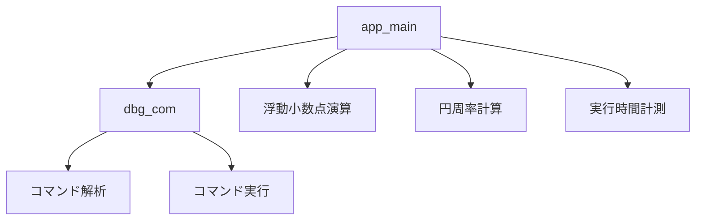
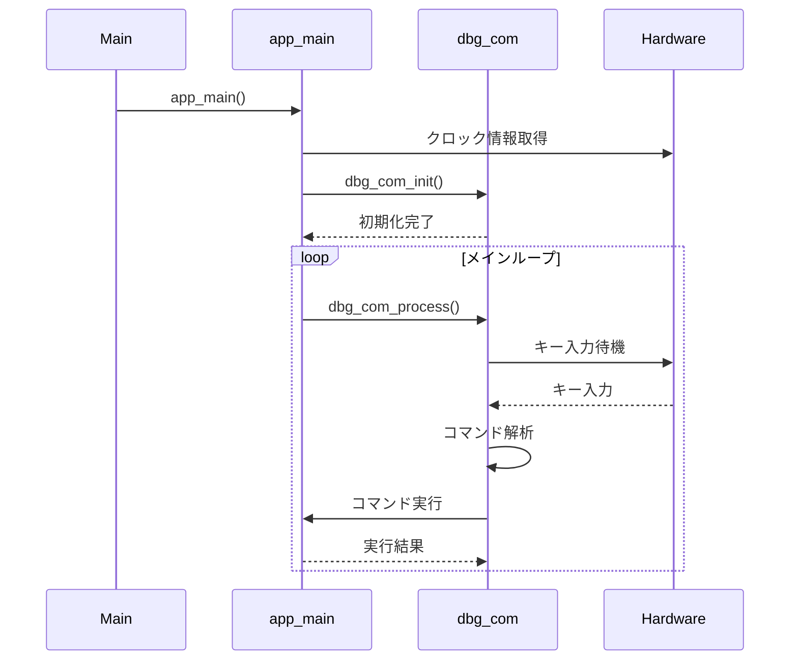
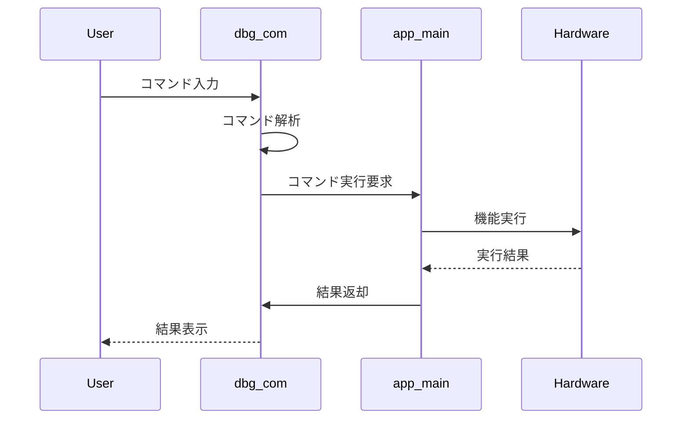
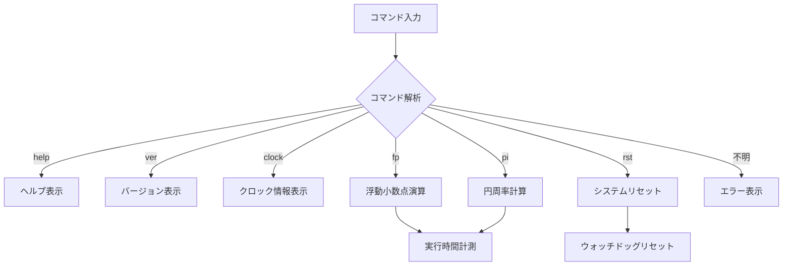

# RP2350評価F/W設計書

## 1. 概要

RP2350で動作するデバッグコマンドモニターの設計仕様書。
浮動小数点演算のテストや円周率計算などの実行時間の計測も可能して性能を評価する。

## 2. システム構成

### 2.1 モジュール構成



### 2.2 シーケンス図

#### 2.2.1 システム起動シーケンス



#### 2.2.2 コマンド実行シーケンス



## 3. API仕様

### 3.1 デバッグコマンドモニター (dbg_com)

#### 3.1.1 初期化関数
```c
void dbg_com_init(void);
```
- 機能: デバッグコマンドモニターの初期化
- 引数: なし
- 戻り値: なし

#### 3.1.2 メイン処理関数
```c
void dbg_com_process(void);
```
- 機能: コマンド入力の受付と処理
- 引数: なし
- 戻り値: なし

### 3.2 アプリケーション (app_main)

#### 3.2.1 浮動小数点演算テスト
```c
void floating_point_test(void);
```
- 機能: 浮動小数点演算のテスト実行
- 引数: なし
- 戻り値: なし

#### 3.2.2 円周率計算
```c
double calculate_pi_gauss_legendre(int32_t iterations);
```
- 機能: Gauss-Legendreアルゴリズムによる円周率計算
- 引数: 
  - iterations: 計算の反復回数
- 戻り値: 計算された円周率の値

#### 3.2.3 実行時間計測
```c
void measure_execution_time(void (*p_func)(void), const char* p_func_name, ...);
```
- 機能: 関数の実行時間を計測
- 引数:
  - p_func: 計測対象の関数ポインタ
  - p_func_name: 関数名（表示用）
  - ...: 可変長引数
- 戻り値: なし

## 4. ソース仕様

### 4.1 定数定義

```c
#define DBG_CMD_MAX_LEN 32  // コマンドの最大長
#define DBG_CMD_MAX_ARGS 4  // コマンドの最大引数数
```

### 4.2 データ構造

#### 4.2.1 コマンド種類
```c
typedef enum {
    CMD_HELP,       // ヘルプ表示
    CMD_VER,        // バージョン表示
    CMD_CLOCK,      // クロック情報表示
    CMD_FP_TEST,    // 浮動小数点演算テスト
    CMD_PI_CALC,    // 円周率計算
    CMD_RST,        // リセット
    CMD_UNKNOWN     // 不明なコマンド
} dbg_cmd_t;
```

#### 4.2.2 コマンド情報構造体
```c
typedef struct {
    const char* p_cmd_str;     // コマンド文字列
    dbg_cmd_t cmd_type;        // コマンド種類
    const char* p_description; // コマンドの説明
    int32_t min_args;          // 最小引数数
    int32_t max_args;          // 最大引数数
} dbg_cmd_info_t;
```

#### 4.2.3 コマンド引数構造体
```c
typedef struct {
    int32_t argc;                    // 引数の数
    char* p_argv[DBG_CMD_MAX_ARGS]; // 引数の配列
} dbg_cmd_args_t;
```

### 4.3 命名規則

- グローバル変数: `g_` プレフィックス
- 静的変数: `s_` プレフィックス
- ポインタ変数: `p_` プレフィックス
- 型: `stdint.h`の型を使用（例：`int32_t`, `uint64_t`）

## 5. コマンド仕様

### 5.1 実装コマンド一覧

| コマンド | 説明 | 引数 |
|---------|------|------|
| help | コマンド一覧表示 | なし |
| ver | SDKバージョン表示 | なし |
| clock | システムクロック情報表示 | なし |
| fp | 浮動小数点演算テスト実行 | なし |
| pi | 円周率計算 | [実行回数] |
| rst | システムリセット | なし |

### 5.2 コマンド実行フロー


